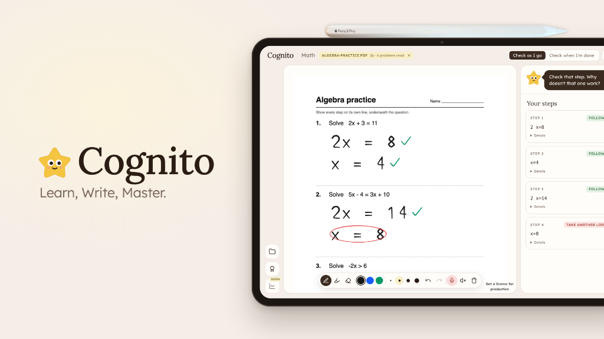

# Cognito

Cognito is an AI tutor that helps you actually learn instead of just handing you answers. It builds a personalized study plan from creators you already trust, then coaches you through homework on a whiteboard, reading your handwriting and giving hints without giving away the solution.

## Inspiration

Khan Academy, The Organic Chemistry Tutor, and 3Blue1Brown are the creators many of us look towards to actually learn. But when we get stuck on homework, we open ChatGPT, get a wall of text, just paste our questions, and learn nothing.

We asked: how can AI help you actually learn instead of just doing your homework for you?

## What it does

1. **Personalized study plan** — tell us what you want to learn and we build a plan around it, shown as a topic graph so you can see how ideas connect.
2. **Lessons built from creators you trust** — each lesson pulls in existing YouTube videos and tutorials from your favorite creators.
3. **Video lessons with your own AI tutor** — watch alongside a tutor that knows where you are in the lesson.
4. **Homework mode** — upload your assignment and work through each problem on a whiteboard with an AI coach. It reads your handwriting, checks your steps, and nudges you toward the answer without handing it over.

## How we built it

**Frontend:** Next.js, React, TypeScript, Tailwind CSS, shadcn/ui, Radix UI, Zustand. Special components: tldraw (whiteboard), React Flow (topic graph), Monaco (code editor), Streamdown (markdown).

**Backend:** Next.js route handlers, tRPC, PostgreSQL (Drizzle ORM), better-auth (anonymous sessions, ChatGPT + Google OAuth), Zod, Docker Compose.

**AI and data:**

- Claude (Anthropic SDK, tool-use generation) and OpenAI GPT for tutoring and generation
- Deepgram for the voice agent
- Jev/TypeSafe as the decision layer — picks each lesson's YouTube video with a typed decision instead of a generative call
- Desmos + Mathpix for math
- Firecrawl to find and pull in learning resources

**Dev tools:** pnpm, Vitest, ESLint, Drizzle Kit, Docker, Windsurf + Devin, GitHub.

## Challenges we ran into

- **Quality of instruction** — generated lesson content can be shallow or wrong. We chose not to generate lessons at all and instead curate the best existing content, using AI to organize, sequence, and personalize it.
- **Teaching without leaking** — a tutor that just answers defeats the purpose. We had to make the AI follow traditional tutoring practice: notice where you're stuck, give a hint, and hold back the solution.
- **Combining inputs into one tutor** — conversation, whiteboard strokes, and lesson progress all had to feed a single, coherent tutor with low latency.

## Accomplishments we're proud of

- A low-latency AI tutor that reads and understands your handwriting on the whiteboard
- Handwritten math and chemistry notation gets checked as you write
- Lesson plans represented as graphs, giving each custom lesson the context of what comes before and after it
- A tutor that behaves like a real one: it nudges you in the right direction and never gives away the answer

## What we learned

We learned how to build one cohesive multimodal AI: conversation, whiteboard strokes, and lesson progress all feed the same tutor, and it still has to hold back the answer and give only hints. The hardest part wasn't building the model — it was deciding what the tutor should *not* say.

## What's next

- Subject-specific tools: a code editor for programming, CAD for engineering
- Testing how our platform helps students learn more than alternatives like ChatGPT
- Improve resource curation quality and greater coverage across subjects

## Individual contributions

- **Angela** — Whiteboard, homework session with coach
- **Evan** — Webcrawler, database, UI, tutor voice
- **Joel** — Lesson generation, API calls, whiteboard features, file uploads
- **Uijin** — Onboarding, lesson plan graph generation and customization

**Sponsor challenges:** Ramp (Save Time. Save Money.) · Cognition (Best Use of Devin) · Deepgram (Build Something Worth Talking To) · The Token Company (LLM Cost Saving) · OpenAI (The Fifth Teammate) · Dropbox (Turn Digital Chaos Into Something Useful) · Long Lake (Convince a Non-Believer)

---

## Run it

```bash
pnpm install
cp .env.example .env.local   # then fill in the keys you have
pnpm dev
```

Open http://localhost:3000.

## Database

Drizzle is configured for Supabase Postgres. Set `DATABASE_URL` in `.env.local`,
review the generated SQL in `drizzle/`, then run `pnpm db:migrate`.
See [the database guide](db/README.md) for the schema, connection options,
migration workflow, and remaining application integration work.

## Authentication

Better Auth uses the existing Drizzle tables with its anonymous plugin. Starting
a topic creates a guest session if one does not already exist; subsequent
requests reuse the session cookie. The `topics` tRPC procedures and the lesson
route require a valid session.

Set these server-only variables in `.env.local`:

```dotenv
BETTER_AUTH_URL=http://localhost:3000
BETTER_AUTH_SECRET=replace-with-a-random-secret
```

Generate the secret with `openssl rand -base64 32`. For deployment, set
`BETTER_AUTH_URL` to the actual HTTPS origin and keep the secret stable across
instances. Local values have been configured for this workspace. Restart the
dev server after changing environment variables.

- Server: `getAuth()` from `@/lib/auth`; read a session with
  `getAuth().api.getSession({ headers: request.headers })` in a route handler.
  Always derive ownership from `session.user.id`.
- Client: `authClient` from `@/lib/auth-client` exposes `useSession()`,
  `signIn.anonymous()`, and `signOut()`. `ensureAnonymousSession()` reuses an
  existing session and coalesces simultaneous sign-in attempts in a tab.
- Auth endpoints are mounted at `/api/auth/[...all]` using the Node.js runtime.
- Account linking transfers plans before deleting the guest identity. Email
  and OAuth sign-in are not enabled yet. Signing out of a guest account does
  not provide a way to recover it without a linked authentication method.

## Swapping the AI provider

The model dropdown lets you pick who generates the roadmap. A provider shows up as available once its credentials are in `.env.local` (or, for local, once the server is reachable). The dropdown lists Cerebras, OpenAI, Grok, Claude, then Local, and defaults to the first one that is set up.

| Provider | Env vars | Default model |
| --- | --- | --- |
| Cerebras (via OpenRouter) | `OPENROUTER_API_KEY`, optional `OPENROUTER_MODEL` | `openai/gpt-oss-120b` |
| OpenAI | `OPENAI_API_KEY`, optional `OPENAI_MODEL` | `gpt-5` |
| Grok | `XAI_API_KEY`, optional `XAI_MODEL` | `grok-4` |
| Claude | `ANTHROPIC_API_KEY`, optional `ANTHROPIC_MODEL` | `claude-opus-5` |
| Local | optional `LOCAL_BASE_URL`, `LOCAL_MODEL`, `LOCAL_API_KEY` | auto-detected from the server, preferring a Qwen model |

Optional: set `YOUTUBE_API_KEY` (YouTube Data API v3) to pick lesson videos through the official API. Without it the app reads the first result off YouTube's public search page, and falls back to a search link if that fails.

Local points at Ollama (`http://localhost:11434/v1`) by default. Pull a model and keep Ollama running:

```bash
ollama pull qwen3:8b
```

LM Studio, vLLM and llama.cpp work too: set `LOCAL_BASE_URL` to their OpenAI-compatible endpoint and `LOCAL_MODEL` to the model name.

## How it works

- `/topics` lists the learner's roadmaps (the onboarding `roadmaps` table); `/topics/[id]` shows one as a clickable graph; `/topics/[id]/module/[nodeId]` is that node's lesson (`components/topics/ModulePane.tsx` streams it into `components/Lesson.tsx` the first time, then it is stored in `roadmap_lessons`); `/topics/[id]/module/[nodeId]/chat` is the tutor for it. Each page fetches its own data through `server/topics.ts`.
- Every generation route streams newline-delimited JSON (`lib/stream.ts` on the server, `lib/ndjson.ts` on the client) so the page can render partial results: lesson headings and section text, quiz questions and tutor replies all appear as they are written. `lib/partial-json.ts` repairs the half-finished JSON the model has produced so far.
- `app/api/lesson/route.ts` takes `{ roadmapId, nodeId }` and writes that node's lesson in two phases: a short plan (title, section headings with one-line intents, takeaways), then every section body in parallel from that plan. Resource links and the video are looked up at the same time; links that don't resolve are dropped (`lib/links.ts`) and the video comes from the model's search query (`lib/youtube.ts`).
- `app/api/lesson/chat/route.ts` is the tutor: it streams a reply and, when asked to change the lesson, returns the full rewritten lesson. `app/api/quiz/route.ts` writes a 5-question multiple-choice quiz.
- `server/router.ts` is a typed tRPC API over the same providers; `app/api/trpc/[trpc]/route.ts` exposes it and `lib/trpc.ts` is the browser client. The UI uses it for the provider list and the `topics` router (list/get/delete roadmaps, read and save lessons). Its `tutor` and `quiz` procedures return whole responses for callers that do not need streaming.
- `lib/providers/` holds one adapter per provider, each exposing one `structured()` call that returns JSON matching a Zod schema, streaming the raw text when a callback is given. Reasoning models run at minimal effort: on gpt-5 that cuts the wait for the first token from ~35s to ~2s with no visible drop in quality. Claude uses the Anthropic SDK with structured outputs. OpenAI, Grok and local models all speak the OpenAI chat-completions protocol, so they share one adapter that asks for a JSON schema response and degrades to looser formats for older local servers.
- `lib/prompt.ts` holds the prompts: lesson writer, tutor and quiz writer; `lib/modules.ts` frames a roadmap node as a lesson request.
