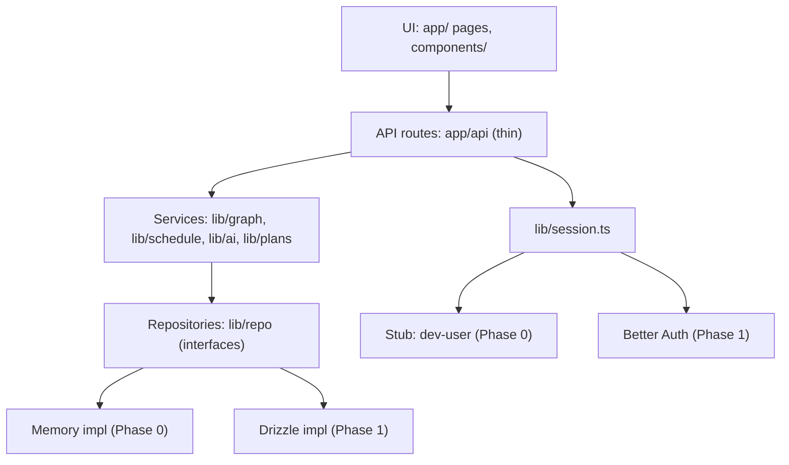

# Architecture

## Stack

| Layer | Choice | Status |
|---|---|---|
| Framework | Next.js (App Router), TypeScript strict | Confirmed |
| Styling | Tailwind | Confirmed |
| UI kit | shadcn/ui | Proposed |
| Client state | Zustand | Proposed |
| Graph UI | React Flow (`@xyflow/react`) + dagre (`@dagrejs/dagre`) | Confirmed |
| Validation and types | zod (v4 preferred) | Confirmed |
| AI | Claude API (`@anthropic-ai/sdk`) | Confirmed |
| Database | Supabase Postgres (plain Postgres, no Supabase Auth or client SDK) | Confirmed, Phase 1 |
| ORM | Drizzle | Confirmed, Phase 1 |
| Auth | Better Auth, anonymous plugin | Confirmed, Phase 1 |
| Tests | Vitest | Proposed |
| Hosting | Vercel | Proposed |

## Layers

Principles:

- **Routes are thin.** They validate input with zod, get `userId` from the session, call a service, and return JSON.
- **Pure logic is pure.** `lib/graph` and `lib/schedule` take plain objects and return plain objects. No React, no I/O, no globals. They are the most tested code in the repo.
- **Repositories are the only persistence seam.** Nothing outside `lib/repo` knows whether data lives in memory or Postgres. This is what lets Phase 0 proceed while database decisions are pending.
- **AI sits behind `lib/ai`.** Everything else calls typed functions, never the SDK.

## AI integration

- **Forced tool calls only.** Each function defines one tool whose `input_schema` comes from a zod schema, and sets `tool_choice` to that tool. Output is validated with zod (and `validateGraph` for graphs).
- **Retry once** with the validation errors appended to the prompt. If it still fails, use the function's **fallback** (see `onboarding-spec.md`).
- **Mock mode.** `MOCK_AI=true` swaps every function for a deterministic mock built from `fixtures/`. UI work never needs an API key.
- **Models** are constants in `lib/ai/models.ts` (`FAST_MODEL`, `STRONG_MODEL`). Proposed defaults: `claude-haiku-4-5-20251001` for concepts, `claude-sonnet-5` for graph generation and enrichment; chat edits start on the fast model and move up if the eval shows poor op quality. Verify current model names in Anthropic's docs before relying on them.
- **Compact serialization** for edit turns: send nodes as `id | title | kind | scope | parentId` and edges as `source>target (kind)`, not full JSON. Cuts latency and cost.
- **Latency targets (to measure, not promises):** concepts under 3s, edit turn under 6s, initial graph under 15s, plan generation (parallel enrichment) under 30s.

## Persistence model

Summary (full detail in `data-contract.md`):

- `study_plans.graph` is JSONB holding the whole `PlanGraph`; all changes go through `applyOps`.
- `study_plans` also holds the `profile` snapshot, `order` (leaf ids in study order), and `schedule`. One row per goal, edited in place with `version` bumped.
- `onboarding_sessions` holds the in-progress profile, draft graph, and chat messages, keyed by user.
- `topic_progress` and `node_content` are keyed by `(plan_id, node_id)` where `node_id` is a logical reference into the graph JSON, not a foreign key.

## Auth and sessions

- Phase 0: `requireUserId()` returns a fixed dev id.
- Phase 1: Better Auth anonymous sessions. The landing CTA ensures a session (check `getSession` first), then routes to onboarding. A route guard, `getUserState(userId)`, returns the current step and active plan id so refreshes and deep links land correctly.
- Account upgrade (Google or email linking) is out of scope for the demo. The `migrateUserData` stub exists so it can be added without touching other tables.

## Testing strategy

| Kind | Where | Covers |
|---|---|---|
| Unit | `lib/graph/*.test.ts`, `lib/schedule/*.test.ts` | validation, ops, topological sort, fallback graph, scheduler math |
| Repo contract | `lib/repo/repo.contract.test.ts` | runs against memory now and Drizzle later; proves the swap is safe |
| Route integration | `app/api/**/*.test.ts` | happy paths with `MOCK_AI=true` |
| AI eval | `scripts/eval-graph.ts` | validation pass rate, node counts, latency across sample profiles |
| Manual | demo checklist in `kickoff-plan.md` (M7) | 3-minute path, mobile layout |

## Phases

| Phase | Goal | Touches DB? |
|---|---|---|
| 0 | Onboarding end to end on memory repos and a stub session | No |
| 1 | Swap in Drizzle repos and Better Auth, run the same contract tests | Yes |
| 2 | Integrate with the learning experience (`getNextNode`, progress on `<TopicGraph>`) | Yes |
| 3 | Spaced repetition, chatbot, avatar teach-back | Yes |
