# Data Contract Decisions and Flow Diagrams

Team-facing doc for the HackMIT education project. Everything here is a **proposal with a default answer**. In the hour-0 sync, ratify the defaults or amend them. Anything nobody objects to is locked.

Stack: Next.js, Supabase Postgres, Drizzle, Better Auth (anonymous plugin), React Flow + dagre, Claude API, zod.

**Contents**

1. Decisions to lock now (with recommendations)
2. The proposed contract (types, tables, shared functions)
3. Flow diagrams
4. Deliberately deferred decisions
5. Hour-0 sync script (15 minutes)

---

## 1. Decisions to lock now

| # | Decision | Recommended default | Who it affects |
|---|---|---|---|
| D1 | Source of truth for types | zod schemas in `types/learning.ts`, TS types inferred | Everyone |
| D2 | How the topic graph is stored and mutated | JSONB on `study_plans.graph`, mutated only through `applyOps` | Learning owner |
| D3 | Node identity and lifecycle | Stable slug ids, unique per plan, never hard-deleted after the plan is saved | Everyone with per-node data |
| D4 | Two separate status fields | `scope` on the node, `progress` in its own table | Learning owner, plan view |
| D5 | Lesson unit and node guarantees | Lessons attach to leaf nodes, saved plans always have objectives | Learning owner |
| D6 | Who computes "what's next" | One `order` array on the plan plus `getNextNode()` | Learning owner |
| D7 | Plan record shape | One row per goal, profile snapshotted on the plan, routes by `planId` | Everyone |
| D8 | Identity and account linking | Server-derived `userId`, key data by `planId` where possible | Everyone |
| D9 | Time and units | Minutes, ISO strings, `timestamptz`, learner timezone captured | Spaced repetition later |
| D10 | Table ownership and module boundaries | Owners write, everyone reads through `lib/plans` | Everyone |
| D11 | Where lesson content is generated | Lazily per leaf node by the learning owner, cached in `node_content` | Learning owner |
| D12 | Team workflow for schema and AI config | One shared DB, one schema owner, model names in one file | Everyone |

### D1. Source of truth for types

- **Recommend:** define zod schemas in `types/learning.ts` and infer TS types from them. The same schemas validate API request bodies, type the Drizzle JSONB columns (`$type<...>()`), and produce the JSON Schema for Claude tool inputs (`z.toJSONSchema` in zod 4, or `zod-to-json-schema` on zod 3).
- **Alternative:** hand-written TS interfaces plus a separate JSON Schema for prompts. Rejected: the two drift within hours.
- **Why now:** every teammate imports from this file. Changing a type later means touching everyone's code.

### D2. Graph storage and mutation

- **Recommend:** the whole graph lives in `study_plans.graph` (JSONB). Nobody edits the JSON by hand. All changes go through `applyOps(graph, ops)` and `validateGraph()` in `lib/graph`.
- **Alternative:** normalized `nodes` and `edges` tables. Rejected: the graph is always read and written whole, the LLM output shape will keep changing during the hackathon, and joins plus migrations cost time.
- **Consequence:** the learning owner treats the graph as **read-only**. If they need to change it (for example, add a remedial node), they call `applyPlanOps`.

### D3. Node identity and lifecycle

- **Recommend:** ids are lowercase snake_case slugs (`attention_mechanism`), unique **within a plan** (not globally), immutable once created. The server dedupes collisions with a numeric suffix.
- **Lifecycle rule:** while a plan is being workshopped (draft), nodes can be added and deleted freely. **After the plan is saved, nodes are never hard-deleted.** "Delete" means `scope: "excluded"`.
- **Why:** progress, review cards, and assessments reference `(planId, nodeId)` with no foreign key into the graph JSON. A hard delete would orphan those rows, or silently reattach them if a new node reuses the slug.
- **Alternative:** uuid ids. Rejected: unreadable in prompts and logs, no upside here.

### D4. Two separate status fields

- **Recommend:** rename the node field `status` to **`scope`** (`included` | `known` | `excluded`), meaning "is this part of the plan". Learner **`progress`** (`todo` | `in_progress` | `done`) lives in a separate table owned by the learning experience.
- **Why:** with one field called `status` on the node and another in the progress table, someone will write to the wrong one. Different names prevent it.
- `known` means "learner claims they know this", not verified. Later features can verify it.

### D5. Lesson unit and node guarantees

- **Lessons attach to leaf nodes** (nodes with no children). Parent nodes are containers: their time is the sum of their children (`estMinutes` is `0` on containers) and their progress is rolled up in the UI.
- **Two node types, same shape:**
  - `DraftNode`: exists during the workshop. `objectives` is optional.
  - `PlanNode`: exists in saved plans. `objectives` always has at least one entry. If enrichment fails for a module, the server fills a fallback (`"Explain <title> in your own words"`).
- **Consequence:** learning-experience code only ever sees `PlanNode` and never null-checks `objectives`.
- **Alternative:** lessons on every node. Rejected: containers stop meaning anything and time gets double counted.

### D6. "What's next" is computed once

- **Recommend:** the plan stores `order: string[]`, the flattened study order of leaf nodes with `scope: "included"` (core nodes first in prerequisite order, children in array order, then optional nodes). `getNextNode(plan, progressMap)` returns the first leaf whose progress is not `done`.
- **Alternative:** each teammate derives order from `schedule` or the graph. Rejected: divergent topological sorts and off-by-one bugs.

### D7. Plan record shape

- **Recommend:** one `study_plans` row per learning goal. Edits update `graph` and bump `version` **in place**. The learner profile is **snapshotted onto the plan** at generation time (goal, deadline, and hours per week are per-goal, and the chatbot and avatar read them from the plan).
- All routes use `/plan/[planId]/...`. The database allows many plans per user; the UI exposes only one for now. This is cheap insurance for multiple goals later.
- **Alternative:** a single `learner_profiles` row per user. Rejected: goal and deadline change per plan. Truly per-user settings (tutor style, timezone) can move to a user preferences table later.

### D8. Identity and account linking

- **Recommend:** `userId` is a **text** id from the Better Auth session, derived server-side only. Never accept a `userId` from a request body.
- **Key data by `planId`, not `userId`, wherever possible** (progress, content, cards, assessments). Then account linking only has to move `study_plans.user_id` (and `onboarding_sessions`), and the rest follows automatically.
- Better Auth deletes the anonymous user after linking, and `onDelete: "cascade"` would delete their data with them, so `onLinkAccount` must move rows first. It calls one function, `migrateUserData(fromId, toId)`, and any teammate table that has a raw `user_id` adds a line there.
- **Scope call to make:** account upgrade is **out of scope for the demo** (cut list item 1). Build the function stub now and skip the UI.

### D9. Time and units

- Durations: **minutes** everywhere (`estMinutes`, `minutes`).
- Dates inside JSON: ISO 8601 strings. Timestamps in Postgres: **`timestamptz`** (`timestamp(..., { withTimezone: true })` in Drizzle).
- Capture the learner's IANA timezone silently (`Intl.DateTimeFormat().resolvedOptions().timeZone`) into `profile.availability.timezone`. Spaced repetition needs it for "due today", and retrofitting it later is painful.

### D10. Table ownership and module boundaries

| Owner | Writes | Reads |
|---|---|---|
| Onboarding | `onboarding_sessions`, `study_plans` | Better Auth tables |
| Learning experience | `topic_progress`, `node_content` | `study_plans` via `lib/plans` |
| Future (spaced repetition, avatar) | `review_cards`, `assessments` | plans, progress via `lib/plans` |

- **Rule:** nobody writes to a table they don't own. Ask the owner for a function instead.
- **Rule:** everyone reads plans through `lib/plans`, not raw queries on `study_plans`.
- Shared code lives in `types/`, `lib/graph/`, `lib/plans/`, `lib/user-data.ts`, and `components/TopicGraph`.

### D11. Where lesson content is generated

- **Recommend:** the learning owner generates lesson content **lazily** the first time a leaf node is opened and caches it in `node_content`. Onboarding only produces objectives, never lesson content.
- Pre-generating the first node during the "Generating your plan" screen is a nice optional trick, but it's the learning owner's call.

### D12. Team workflow for schema and AI config

- **One shared Supabase project** for dev. One schema owner runs `drizzle-kit push` after schema PRs merge to main. Everyone reads the push diff before confirming (push can try to drop a teammate's table from another branch).
- **One `lib/ai/models.ts`** exporting `FAST_MODEL` and `STRONG_MODEL`, so models can be swapped in one place. One shared Anthropic API key.

---

## 2. The proposed contract

### Types (zod, in `types/learning.ts`)

```ts
import { z } from "zod";

export const NodeId = z.string().regex(/^[a-z0-9_]{1,60}$/);

export const DraftNode = z.object({
  id: NodeId,
  title: z.string().min(1).max(80),
  summary: z.string().max(140),
  kind: z.enum(["core", "optional"]),         // core = spine, optional = side branch
  parentId: NodeId.optional(),                // max depth 2
  estMinutes: z.number().int().min(0).max(600), // 0 on containers (nodes with children)
  scope: z.enum(["included", "known", "excluded"]),
  objectives: z.array(z.string().min(1)).optional(),
});

export const PlanNode = DraftNode.extend({
  objectives: z.array(z.string().min(1)).min(1), // assessable statements, always present
});

export const Edge = z.object({
  id: z.string(),
  source: NodeId,
  target: NodeId,
  kind: z.enum(["prerequisite", "related"]),  // only prerequisite constrains order
});

export const DraftGraph = z.object({
  title: z.string(),
  nodes: z.array(DraftNode).max(30),
  edges: z.array(Edge),
});
export const PlanGraph = DraftGraph.extend({ nodes: z.array(PlanNode).max(30) });

export const LearnerProfile = z.object({
  goal: z.string(),
  goalType: z.enum(["career", "exam", "project", "curiosity"]).optional(),
  deadline: z.string().optional(),            // ISO date
  hoursPerWeek: z.number(),
  priorKnowledge: z.array(z.object({ concept: z.string(), level: z.union([z.literal(0), z.literal(1), z.literal(2)]) })),
  preferences: z.object({
    formats: z.array(z.enum(["reading", "video", "practice", "discussion", "voice"])),
    pace: z.enum(["relaxed", "steady", "intense"]),
  }),
  tutorStyle: z.enum(["encouraging", "socratic", "rigorous"]).optional(),
  availability: z.object({
    daysPerWeek: z.number(),
    timeOfDay: z.enum(["morning", "afternoon", "evening"]).optional(),
    timezone: z.string().optional(),          // IANA, captured silently
  }).optional(),
  constraints: z.string().optional(),
});

export const ScheduleWeek = z.object({ week: z.number(), nodeIds: z.array(NodeId), minutes: z.number() });

export const GraphOp = z.discriminatedUnion("op", [
  z.object({ op: z.literal("add_node"), node: DraftNode }),
  z.object({ op: z.literal("update_node"), id: NodeId, patch: DraftNode.omit({ id: true }).partial() }),
  z.object({ op: z.literal("remove_node"), id: NodeId }),   // draft: delete. saved plan: becomes scope "excluded"
  z.object({ op: z.literal("add_edge"), edge: Edge }),
  z.object({ op: z.literal("remove_edge"), id: z.string() }),
]);
```

### Tables

Onboarding owner (`db/schema.ts`):

```ts
export const onboardingSessions = pgTable("onboarding_sessions", {
  userId: text("user_id").primaryKey().references(() => user.id, { onDelete: "cascade" }),
  step: text("step").notNull().default("questionnaire"), // questionnaire | workshop | generating | done
  profile: jsonb("profile").$type<Partial<LearnerProfile>>().default({}),
  draftGraph: jsonb("draft_graph").$type<DraftGraph>(),
  messages: jsonb("messages").$type<{ role: "user" | "assistant"; content: string }[]>().default([]),
  updatedAt: timestamp("updated_at", { withTimezone: true }).defaultNow().notNull(),
});

export const studyPlans = pgTable("study_plans", {
  id: uuid("id").defaultRandom().primaryKey(),
  userId: text("user_id").notNull().references(() => user.id, { onDelete: "cascade" }),
  version: integer("version").notNull().default(1),
  title: text("title").notNull(),
  profile: jsonb("profile").$type<LearnerProfile>().notNull(),   // snapshot at generation time
  graph: jsonb("graph").$type<PlanGraph>().notNull(),
  order: jsonb("order").$type<string[]>().notNull(),             // leaf node ids in study order
  schedule: jsonb("schedule").$type<ScheduleWeek[]>().notNull(),
  createdAt: timestamp("created_at", { withTimezone: true }).defaultNow().notNull(),
  updatedAt: timestamp("updated_at", { withTimezone: true }).defaultNow().notNull(),
});
```

Learning owner (proposed columns; they own the exact Drizzle code):

```
topic_progress: plan_id (fk study_plans, cascade), node_id (text), progress (todo | in_progress | done),
                updated_at (timestamptz). PK (plan_id, node_id). A missing row means todo.
node_content:   plan_id (fk study_plans, cascade), node_id (text), kind (text), body (jsonb),
                generated_at (timestamptz). PK (plan_id, node_id, kind).
```

### Shared functions (`lib/plans`, `lib/graph`, `lib/user-data`)

```ts
// lib/plans
getPlan(planId: string, userId: string): Promise<StudyPlan | null>
getActivePlan(userId: string): Promise<StudyPlan | null>          // most recently created, for now
getNextNode(plan: StudyPlan, progress: Record<string, Progress>): PlanNode | null
applyPlanOps(planId: string, userId: string, ops: GraphOp[]): Promise<StudyPlan>
  // validates, converts remove_node to scope "excluded", bumps version

// lib/graph
validateGraph(graph): { ok: true } | { ok: false; errors: string[] }
applyOps(graph, ops): graph                                        // pure
topoSort(graph): string[]
layout(nodes, edges): positions                                    // dagre

// lib/user-data
migrateUserData(fromUserId: string, toUserId: string): Promise<void>
```

### Shared component

```tsx
<TopicGraph
  graph={PlanGraph | DraftGraph}
  mode="edit" | "view"
  highlightIds={string[]}                                    // flash nodes touched by the last ops
  progress={Record<string, "todo" | "in_progress" | "done">} // supplied by the learning owner
  onNodeClick={(node) => void}
/>
```

---

## 3. Flow diagrams

### 3.1 End-to-end user journey

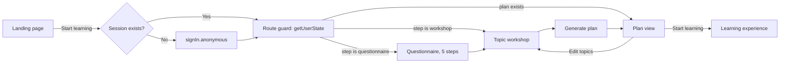

### 3.2 Where a user should be (route guard state machine)

The route guard is one function, `getUserState(userId)`, that returns the current step and the active plan id. Every page calls it, so refreshes and deep links always land in the right place.

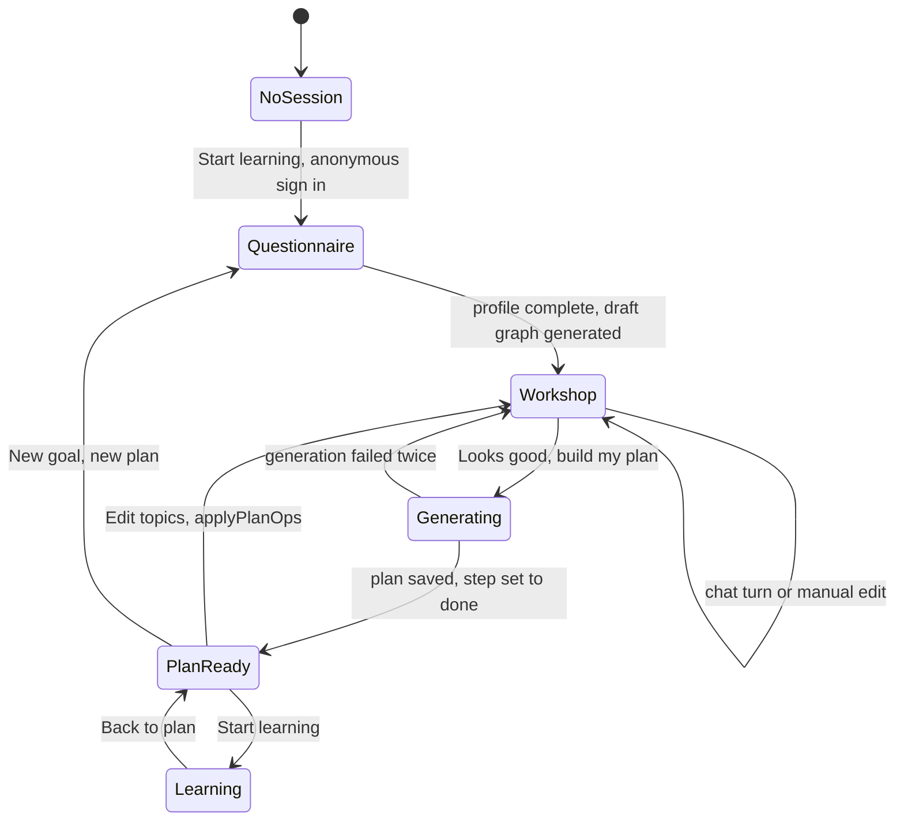

### 3.3 Auth: anonymous sign-in and account linking

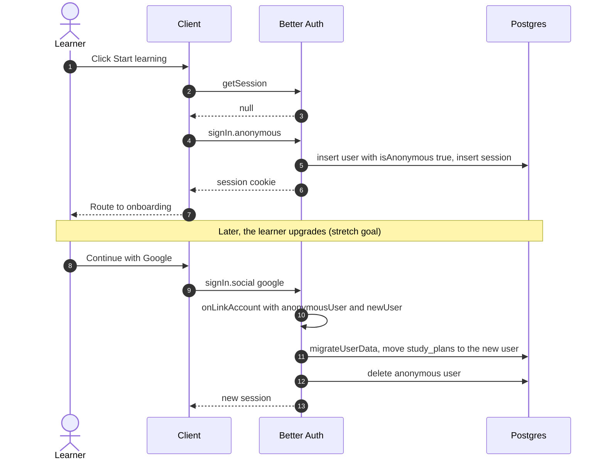

### 3.4 Questionnaire

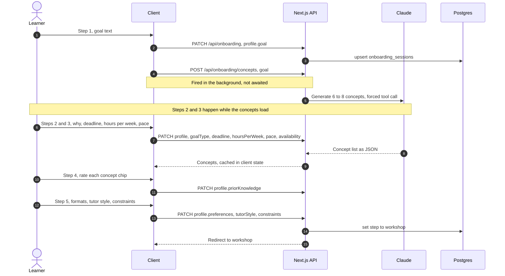

### 3.5 Workshop: initial graph generation

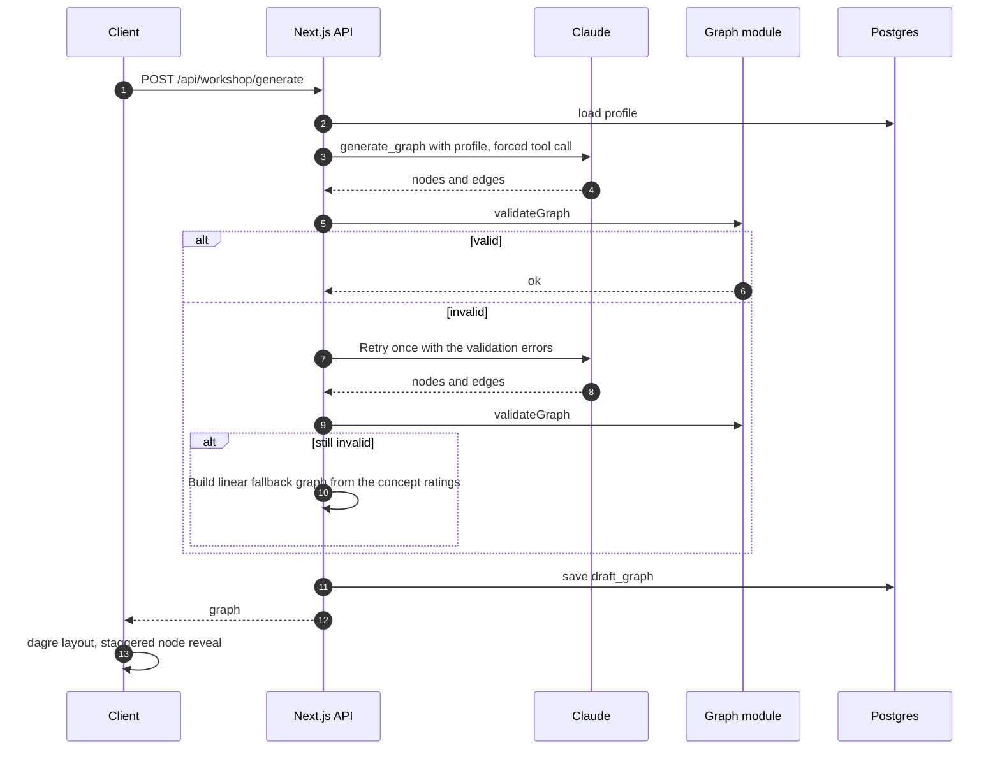

### 3.6 Workshop: a chat turn

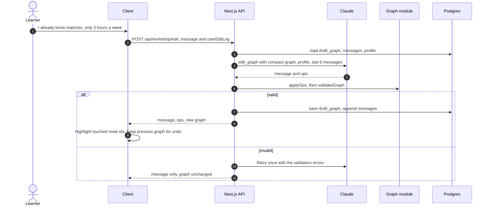

### 3.7 Every edit becomes ops

Manual edits, chat edits, and (later) assessment results all use the same path. There is no second way to change a graph.

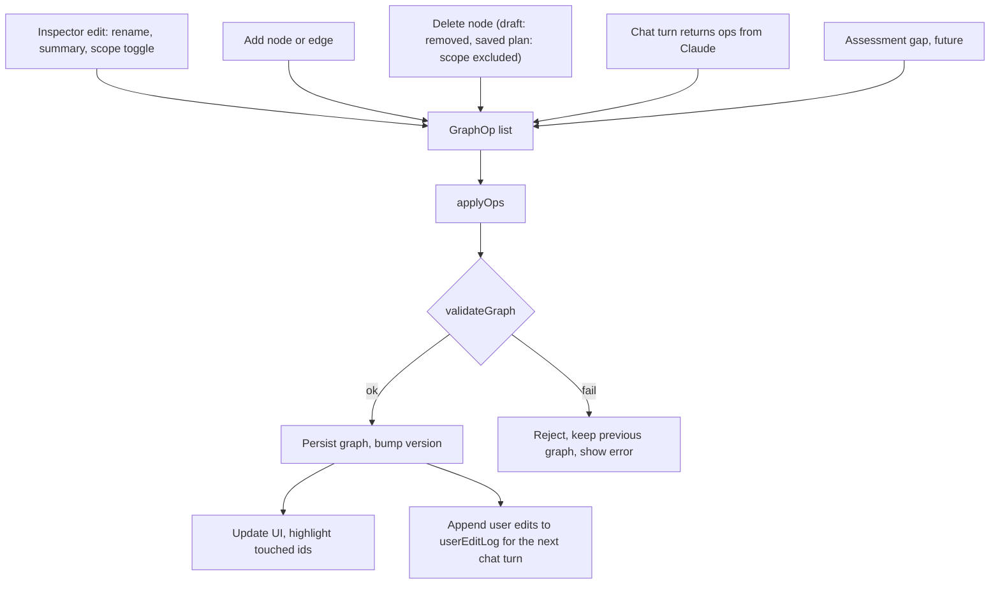

### 3.8 Graph validation

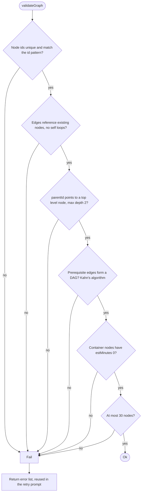

### 3.9 Plan generation

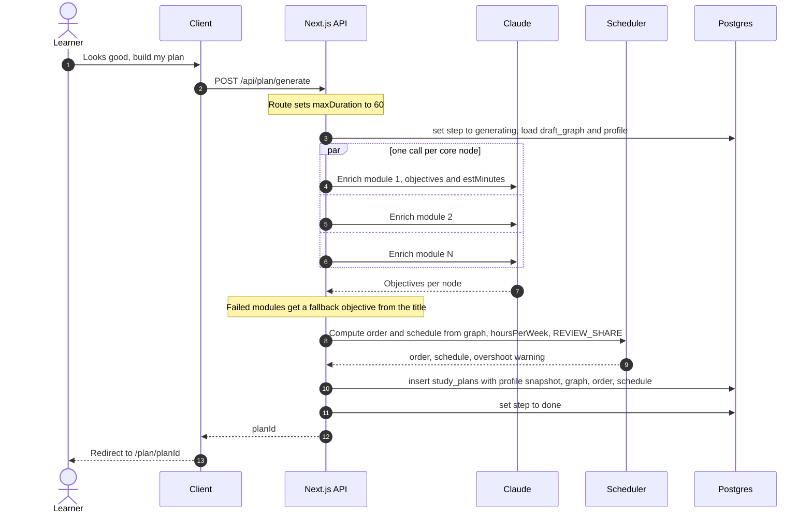

### 3.10 Scheduler

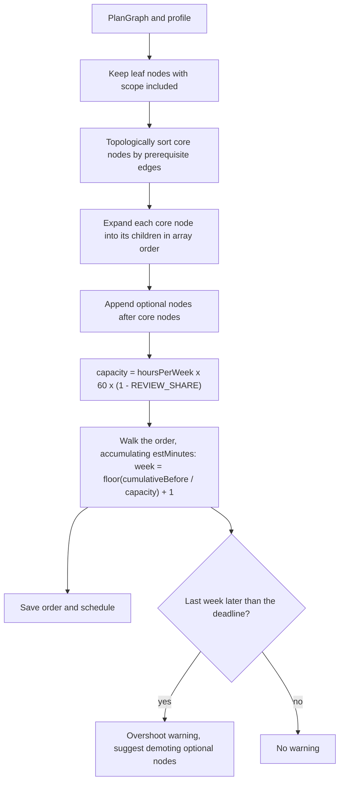

### 3.11 Data model

`node_id` columns are **logical references** into the graph JSON, not foreign keys. That is why D3 forbids hard-deleting nodes after a plan is saved.

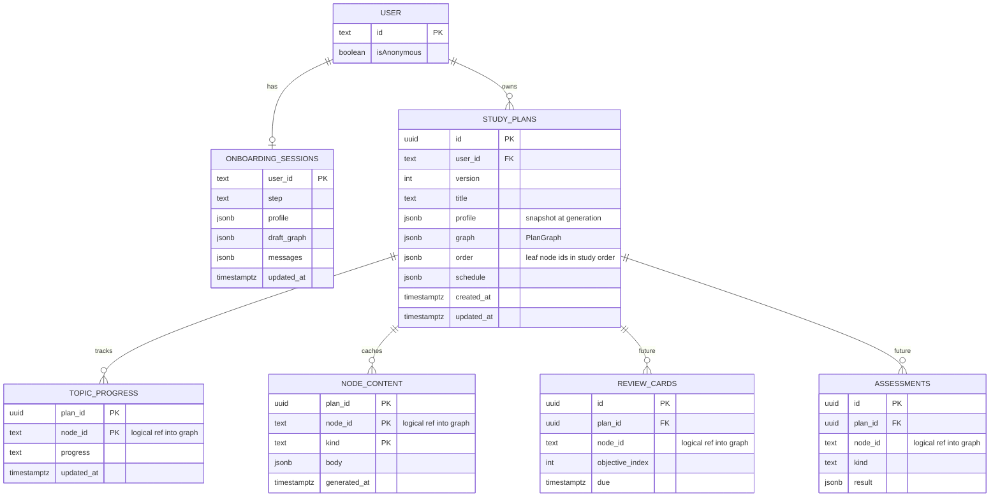

### 3.12 Ownership and module boundaries

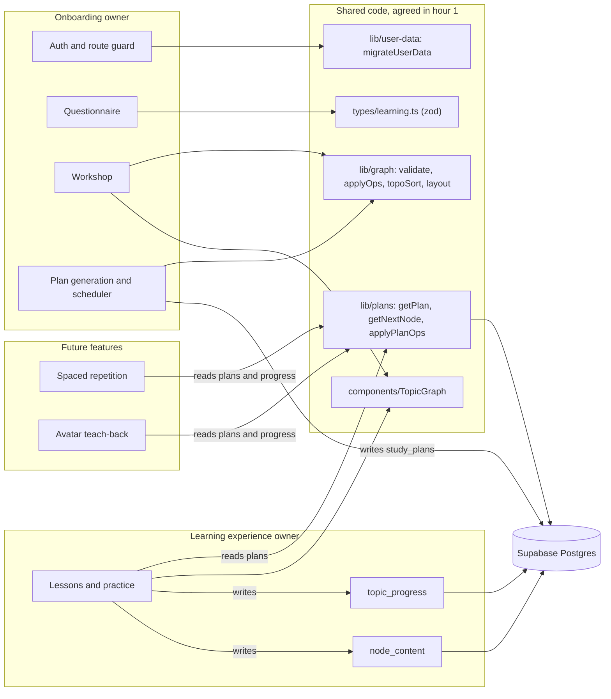

### 3.13 The future learning loop (why the contract carries objectives and stable ids)

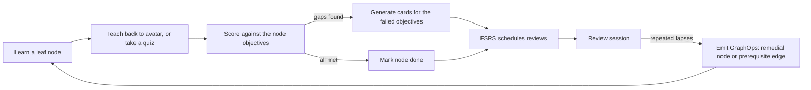

---

## 4. Deliberately deferred decisions

Don't spend hour-0 time on these. Nothing above blocks them.

- Review card schema and FSRS parameters (spaced repetition owner)
- Assessment result shape and rubric scoring format (avatar owner)
- Avatar, speech-to-text, and text-to-speech vendors
- Transcript retention and consent copy
- Notifications and reminder delivery
- Multiple plans in the UI (the data model already allows it)
- Per-user preferences table (tutor style and timezone currently live on the plan snapshot)
- Account upgrade UI (the `migrateUserData` stub exists)

---

## 5. Hour-0 sync script (15 minutes)

Go in order. For each item, ask "any objection to the default?" and write down amendments.

1. **D1 and D12 (2 min):** zod in `types/learning.ts`, one schema owner, one shared DB, `lib/ai/models.ts`.
2. **D4 and D5 (4 min):** `scope` vs `progress`. Lessons attach to leaf nodes. Saved plans always have objectives. Does the learning owner need any other field on a node? Add it now.
3. **D2, D3, D6 (4 min):** JSONB graph, read-only for the learning owner, ids never hard-deleted after save, `order` array and `getNextNode`.
4. **D7, D8 (2 min):** plan-per-goal with a profile snapshot, key by `planId`, account upgrade out of scope for the demo.
5. **D10, D11 (2 min):** who owns which tables, lazy lesson generation.
6. **D9 (1 min):** minutes, ISO, `timestamptz`, timezone captured silently.

**Output of the meeting:** the onboarding owner merges `types/learning.ts` and the stub `getPlan()` returning a hardcoded `PlanGraph` by **hour 3**, so the learning owner can build against real types from then on.
