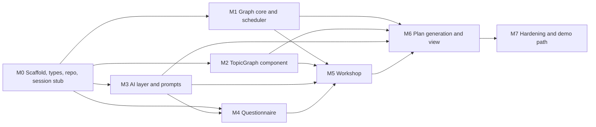

# Kickoff Plan: Phase 0 (No Database)

**Goal:** a working onboarding flow end to end (questionnaire, workshop, plan generation, plan view) running on **in-memory storage** and a **stubbed session**, with mockable AI. It also ships the shared pieces teammates are waiting on: `types/learning.ts`, a stub `getPlan()`, and the `<TopicGraph>` component.

**Hard boundary:** zero imports from `db/`, `drizzle-orm`, `better-auth`, or `@supabase/*`. Persistence goes through `lib/repo/*`, identity through `lib/session.ts`. This is enforced by a lint rule (M0), so database decisions can change without touching this work.

Read first: `CLAUDE.md`, then `onboarding-spec.md` for the milestone you are on.

---

## Dependency map



**Parallelize M1, M2, and M3.** They touch disjoint folders (`lib/graph` + `lib/schedule`, `components/TopicGraph`, `lib/ai`). Run them in separate Claude Code sessions with git worktrees:

```bash
git worktree add ../proj-graph -b feat/graph-core
git worktree add ../proj-topicgraph -b feat/topic-graph
git worktree add ../proj-ai -b feat/ai-layer
```

## Time budget (24-hour build, adjust to yours)

| Milestone | Estimate | Handoff to teammates |
|---|---|---|
| M0 Scaffold, types, repo, session stub | 45 min | **Types and stub `getPlan()` (target: hour 3)** |
| M1 Graph core and scheduler | 2 h | |
| M2 `<TopicGraph>` | 3 h | **`<TopicGraph>` with fixture (dev page)** |
| M3 AI layer and prompts | 2.5 h | |
| M4 Questionnaire | 2.5 h | |
| M5 Workshop | 3 h | |
| M6 Plan generation and view | 2.5 h | **Real plans and `getNextNode`** |
| M7 Hardening and demo path | 1.5 h | |

Serial total is about 17.5 h; with M1 to M3 in parallel it drops to roughly 13 to 14 h.

---

## M0: Scaffold, types, repo, session stub (45 min)

**Tasks**

1. `npx create-next-app@latest` (TypeScript yes, Tailwind yes, App Router yes, no `src/` dir, alias `@/*`).
2. `npm i zod @anthropic-ai/sdk @xyflow/react @dagrejs/dagre zustand` and `npm i -D vitest tsx`. Add `vitest.config.ts` with the `@/` alias and a `test` script.
3. Create the folder layout from `CLAUDE.md`. Add `.env.example` (`ANTHROPIC_API_KEY`, `MOCK_AI`, `REPO_IMPL`). Confirm `.env*.local` is git-ignored.
4. ESLint `no-restricted-imports` for `db/*`, `drizzle-orm`, `better-auth`, `@supabase/*` (Phase 0 guard).
5. `types/learning.ts`: transcribe zod schemas from `data-contract.md` section 2 and export inferred types. **Also define** the types the contract references but doesn't spell out: `StudyPlan` (`id`, `userId`, `version`, `title`, `profile`, `graph: PlanGraph`, `order`, `schedule`, `createdAt`, `updatedAt`), `Progress` (`"todo" | "in_progress" | "done"`), `OnboardingState` (`step`, `profile`, `draftGraph`, `messages`).
6. `lib/session.ts`: `requireUserId()` returning `"dev-user"`.
7. `lib/repo/`: interfaces `OnboardingRepo` and `PlanRepo`; in-memory implementations stored on `globalThis`; `index.ts` factory choosing by `REPO_IMPL` (default `memory`). Add `repo.contract.test.ts` written against the interface (run against memory now, Drizzle later).
8. `lib/plans/index.ts`: `getPlan`, `getActivePlan`, `getNextNode` built on `PlanRepo`.
9. `lib/ai/models.ts` with `FAST_MODEL` and `STRONG_MODEL`.
10. `fixtures/`: `sampleProfile.ts` (goal: "learn enough linear algebra to understand neural networks", 4 hrs/week, 6-week deadline) and `samplePlanGraph.ts` (valid `PlanGraph`: about 8 core nodes with 2 to 4 leaves each, 2 optional nodes, prerequisite chain, objectives on every leaf, containers at `estMinutes: 0`).
11. A `demo` plan seeded into the memory repo so `getPlan("demo")` returns the fixture as a `StudyPlan`.

**Done when**
- `npm run lint`, `npm test`, `npm run build` pass.
- A teammate can `import { getPlan } from "@/lib/plans"` and get a valid `StudyPlan` for `"demo"`.
- Importing `drizzle-orm` anywhere fails lint.
- PR merged; teammates notified.

**Claude Code prompt**
> Read CLAUDE.md and docs/data-contract.md section 2. Implement M0 from docs/kickoff-plan.md. Don't add any database or auth dependency. Stop when the "Done when" checks pass and summarize what you created.

---

## M1: Graph core and scheduler (2 h)

**Files:** `lib/graph/{validate,applyOps,topoSort,diff,fallback,layout}.ts`, `lib/schedule/schedule.ts`, and a test file for each.

**Tasks**

1. `validateGraph(graph)`: all checks listed in `onboarding-spec.md` section 3. Return every error, not just the first (the errors feed the retry prompt).
2. `applyOps(graph, ops)`: pure; throws `GraphOpError` for missing targets; draft `remove_node` cascades to incident edges and children; dedupes ids on `add_node`.
3. `applyPlanOps(graph, ops)`: same, but `remove_node` becomes `scope: "excluded"` on the node and its children.
4. `topoSort(graph)`: Kahn over `prerequisite` edges only, deterministic tie-breaking by array order.
5. `diff.ts`: `touchedIds(ops)` and `diffGraphs(prev, next)` returning added, changed, and removed ids (drives highlighting and undo).
6. `fallback.ts`: `buildFallbackGraph(profile)` per the fallback description in `onboarding-spec.md`.
7. `layout.ts`: dagre TB layout function (pure, returns positions; also emits synthetic containment edges for `parentId`).
8. `computeOrderAndSchedule` per `onboarding-spec.md` section 4.

**Tests must cover**
- validate: cycle, dangling edge, self loop, duplicate id, bad id pattern, depth over 2, container with nonzero `estMinutes`, more than 30 nodes, and a valid graph.
- applyOps: each op type, missing target throws, cascade delete, id dedupe, purity (input not mutated).
- applyPlanOps: removal becomes excluded, node id still present.
- scheduler: capacity math, core before optional, known and excluded skipped, containers skipped, overshoot detected, deterministic ties, week boundaries.
- fallback: output passes `validateGraph`, known nodes for rating 2.

**Done when:** all tests pass and the fixture graph passes `validateGraph`.

**Claude Code prompt**
> Read CLAUDE.md, docs/onboarding-spec.md sections 3 and 4, and docs/data-contract.md section 2. Implement M1 from docs/kickoff-plan.md with tests first. No React, no I/O. Report the test list when done.

---

## M2: `<TopicGraph>` component (3 h)

**Files:** `components/TopicGraph/{index.tsx,TopicNodeCard.tsx,Inspector.tsx}`, `app/dev/graph/page.tsx`.

**Props** (from the contract, plus one additive prop):

```tsx
<TopicGraph
  graph={PlanGraph | DraftGraph}
  mode="edit" | "view"
  highlightIds={string[]}
  progress={Record<string, Progress>}
  onNodeClick={(node) => void}
  onOps={(ops: GraphOp[]) => void}   // edit mode only; tell the team it was added
/>
```

**Tasks**

1. React Flow with a custom node component; `nodesDraggable={false}`; layout from `lib/graph/layout`; `fitView`.
2. Visual language (original, not a copy of roadmap.sh): core nodes bold and filled, optional lighter, `known` with a check and green tint, `excluded` greyed and struck through. `prerequisite` edges solid, `related` dashed, containment edges thin.
3. Progress coloring from the `progress` prop (todo, in progress, done).
4. `highlightIds`: brief pulse or ring animation that fades.
5. Inspector (edit mode): title, summary, scope toggle, delete, add child. Every change is emitted as `GraphOp[]` through `onOps`, never mutated locally.
6. Dev page `/dev/graph`: renders the fixture in both modes with controls (toggle mode, trigger a highlight, simulate progress, show emitted ops).

**Gotchas:** import `@xyflow/react/dist/style.css`; container needs an explicit height; define `nodeTypes` outside the component.

**Done when**
- The 25-node fixture is legible at 1280px and at 390px without overlapping nodes.
- Highlight animation works; inspector emits valid ops (verified by running them through `applyOps` + `validateGraph` on the dev page).
- No console warnings.
- Teammates notified that the dev page exists.

**Claude Code prompt**
> Read CLAUDE.md and docs/kickoff-plan.md M2. Build `<TopicGraph>` and the `/dev/graph` page using `lib/graph` and `fixtures/samplePlanGraph.ts`. Don't mutate the graph in the component; emit ops. Verify at 1280px and 390px widths.

---

## M3: AI layer and prompts (2.5 h)

**Files:** `lib/ai/{client,models,tools,serialize,withRetry}.ts`, `lib/ai/functions/*.ts`, `lib/ai/mock/*.ts`, `scripts/eval-graph.ts`.

**Tasks**

1. `client.ts`: Anthropic SDK singleton reading `ANTHROPIC_API_KEY`.
2. `tools.ts`: tool definitions with `input_schema` from zod (`z.toJSONSchema`), one per function: `set_concepts`, `set_graph`, `edit_graph`, `set_objectives`.
3. Implement `generateConcepts`, `generateGraph`, `editGraph`, `enrichModule` per `onboarding-spec.md` section 5 (forced tool call, zod validation, `validateGraph` for graphs and post-`applyOps` graphs).
4. `withRetry`: retry once with the validation errors appended; on second failure throw `AiValidationError`.
5. `serialize.ts`: compact graph format for edit turns.
6. Mocks for all four functions, deterministic, built from fixtures, with an optional artificial delay (`MOCK_AI_DELAY_MS`). A canned edit response covers the scenario "skip the calculus, I only have 3 hours a week".
7. `scripts/eval-graph.ts`: run `generateGraph` over 10 varied profiles (different goals, hours, deadlines) and 5 canned chat instructions against `editGraph`. Report first-try pass rate, pass rate after retry, average node count, cycle count, and latency (p50 and max).

**Done when**
- With `MOCK_AI=true` every function returns valid data.
- With a real key, `generateGraph` passes validation on at least 9 of 10 profiles after one retry. If not, iterate the prompt before moving on.
- Measured latencies are pasted into `onboarding-spec.md` (new "Measured" section) so later decisions (which model for edits) use data.

**Claude Code prompt**
> Read CLAUDE.md and docs/onboarding-spec.md section 5. Implement M3 from docs/kickoff-plan.md. Use forced tool calls and zod validation only. Build the mocks first so the UI milestones aren't blocked, then the eval script.

---

## M4: Questionnaire (2.5 h)

**Files:** `app/onboarding/page.tsx`, `components/onboarding/{Step1Goal,Step2Why,Step3Time,Step4Concepts,Step5Style,ProgressBar}.tsx`, `lib/stores/onboarding.ts`, `app/api/onboarding/route.ts`, `app/api/onboarding/concepts/route.ts`.

**Tasks**

1. Zustand store holding `profile`, `step`, and `concepts` (with loading and error state).
2. One question per screen, per the table in `onboarding-spec.md` section 1.2, with validation and Back preserving answers.
3. Persist through `PATCH /api/onboarding` on every step change (route uses `onboardingRepo`).
4. Prefetch concepts after step 1; skeleton if not ready; level-selector fallback on failure or 8s timeout.
5. Silent timezone capture.
6. Resume from `GET /api/onboarding`.
7. On step 5 completion: set `step = "workshop"` and navigate.

**Done when:** acceptance scenarios 1, 2, and 3 pass; mobile layout works at 390px; keyboard navigation works.

**Claude Code prompt**
> Read CLAUDE.md and docs/onboarding-spec.md sections 1.2 and 2. Implement M4 from docs/kickoff-plan.md with `MOCK_AI=true`. Persistence only through `lib/repo`.

---

## M5: Workshop (3 h)

**Files:** `app/onboarding/workshop/page.tsx`, `components/onboarding/{ChatPanel,WorkshopToolbar}.tsx`, `lib/stores/workshop.ts`, `app/api/workshop/{generate,edit,graph}/route.ts`.

**Tasks**

1. Store holds `graph`, `previousGraph` (undo), `highlightIds`, `userEditLog`, `messages`, `status`.
2. On entry, load `draftGraph` or call generate; skeleton and staggered reveal.
3. Generate route: `generateGraph` then `validateGraph`, fallback graph on failure, save draft, return `usedFallback`.
4. Edit route: `editGraph` then `applyOps` then `validateGraph`; on failure return message only with `applied: false`. Save draft and messages on success.
5. Manual edits from the Inspector go to `PATCH /api/workshop/graph` (same `applyOps` and validation path).
6. Highlight touched ids via `diffGraphs`; Undo; Regenerate with confirmation.
7. "Build my plan" sets `step = "generating"` and navigates.

**Done when:** acceptance scenarios 4, 5, and 6 pass with mocks, and scenario 4 works against the real API.

**Claude Code prompt**
> Read CLAUDE.md, docs/onboarding-spec.md sections 1.3, 2, and 3. Implement M5 from docs/kickoff-plan.md. Every graph change goes through `applyOps` and `validateGraph`; the client never mutates graph state directly.

---

## M6: Plan generation and view (2.5 h)

**Files:** `app/api/plan/generate/route.ts`, `app/api/plan/[planId]/route.ts`, `app/api/plan/[planId]/graph/route.ts`, `app/onboarding/generating/page.tsx`, `app/plan/[planId]/page.tsx`, `app/plan/[planId]/learn/[nodeId]/page.tsx` (placeholder), `components/onboarding/{GeneratingScreen,PlanSummary,WeekFilter}.tsx`.

**Tasks**

1. Generate route (`maxDuration = 60`): load draft and profile; `enrichModule` per core node with `Promise.allSettled`; apply fallback objectives for failed modules; validate as a `PlanGraph`; `computeOrderAndSchedule`; save via `planRepo` (profile snapshot, graph, order, schedule); set `step = "done"`; return `planId`.
2. Generating screen with progress text.
3. Plan view: `<TopicGraph mode="view">`, summary line, week filter, overshoot banner, **Start learning** (uses `getNextNode`), **Edit topics** (through `PATCH /api/plan/[planId]/graph` and `applyPlanOps`, then recompute `order` and `schedule`, no LLM).
4. Placeholder learning route showing the node title and objectives, for the learning owner to replace.

**Done when:** acceptance scenarios 7, 8, and 9 pass; refresh keeps the plan (in-memory); the teammate can call `getNextNode` on a real plan.

**Claude Code prompt**
> Read CLAUDE.md and docs/onboarding-spec.md sections 1.4, 1.5, 2, and 4. Implement M6 from docs/kickoff-plan.md. Plans are saved through `planRepo` only; removal in saved plans becomes `scope: "excluded"`.

---

## M7: Hardening and demo path (1.5 h)

**Tasks**

1. Loading, error, and empty states on every screen (checklist in `onboarding-spec.md` section 6).
2. Route integration test with `MOCK_AI=true` covering the happy path from onboarding PATCH to plan fetch.
3. Dev-only "Load demo plan" shortcut (behind `NEXT_PUBLIC_DEV=true`) and a seeded demo path.
4. Pre-generated graph and plan cached for the venue-wifi backup.
5. Time a full run with the real API: goal to saved plan.
6. Mobile pass at 390px on the questionnaire, workshop, and plan view.

**Demo checklist**
- [ ] Full run under 3 minutes with the real API
- [ ] Full run works with `MOCK_AI=true`
- [ ] Refresh mid-flow restores state
- [ ] Chat reshaping demo line works: "I already know matrices and I only have 3 hours a week"
- [ ] Overshoot banner demo works
- [ ] Mobile layout is clean (judges will scan a QR code)

---

## Definition of done for Phase 0

- [ ] All milestone "Done when" criteria met
- [ ] Zero imports of `db/`, `drizzle-orm`, `better-auth`, `@supabase/*` (lint enforced)
- [ ] `getPlan`, `getNextNode`, `<TopicGraph>`, and `types/learning.ts` in use by the learning owner
- [ ] Repo contract tests pass against the memory implementation
- [ ] Eval results and measured latencies recorded in `onboarding-spec.md`

## Phase 1 swap-in (when database decisions land)

| Step | Files | Notes |
|---|---|---|
| 1. Schema | `db/schema.ts`, `db/auth-schema.ts`, `db/index.ts` | Schema owner runs `drizzle-kit push`, everyone reads the diff. Use the pooler URL with `prepare: false`. |
| 2. Drizzle repos | `lib/repo/onboarding.drizzle.ts`, `lib/repo/plans.drizzle.ts` | Run `repo.contract.test.ts` against both implementations; it must pass unchanged. |
| 3. Factory switch | `lib/repo/index.ts` | `REPO_IMPL=drizzle`. |
| 4. Auth | `lib/auth.ts`, `lib/auth-client.ts`, `app/api/auth/[...all]/route.ts`, `lib/session.ts` | Better Auth with the anonymous plugin. Check `getSession` before `signIn.anonymous()`. |
| 5. Route guard | `lib/plans` or `lib/session.ts` | `getUserState(userId)` returns `{ step, activePlanId }`. |
| 6. Account linking (stretch) | `lib/user-data.ts`, `onLinkAccount` | Only `study_plans.user_id` and `onboarding_sessions` need moving if everything else keys by `planId`. |
| 7. Remove Phase 0 lint guard | ESLint config | Restrict imports to `lib/repo/*drizzle*`, `lib/auth*`, and `db/*` instead. |

If the team changes D2 (JSONB vs tables) or D7 (plan shape), only the `lib/repo` Drizzle implementations and `db/` change; `lib/graph`, `lib/schedule`, `lib/ai`, and the UI do not.

## Risks

| Risk | Mitigation |
|---|---|
| Contract changes after M0 | Types are isolated in `types/learning.ts`; repo layer absorbs storage changes |
| Prompt quality is worse than expected | Build the eval script early (M3); fallbacks keep the flow alive; upgrade the edit model |
| Graph layout looks messy | Cap at 30 nodes, depth 2, fixed node size; plain dagre TB first |
| Parallel worktrees conflict | M1 to M3 touch disjoint folders; merge M0 first, rebase before merging |
| Teammates blocked on you | Ship M0 and the `/dev/graph` page first; announce each handoff |
